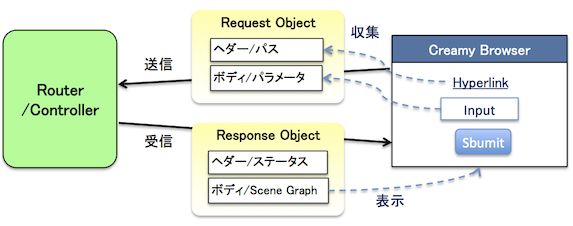
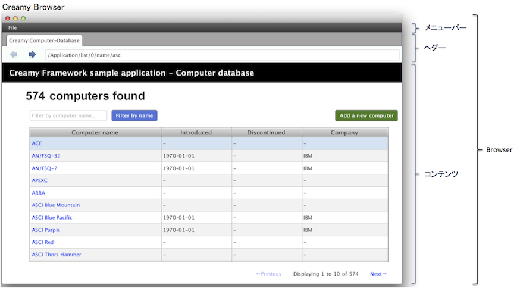

=============================================
Browser
=============================================

Browserの役割
=============================================
WebアプリケーションのUIは、Web Browserによって表示されます。

また、HTTPリクエストを送信し、HTTPレスポンスを受信するのもWeb Browserの役割です。

:doc:`request_response` で、Creamyアプリケーションは、Webアプリケーションと同じように、リクエスト/レスポンスで成り立っていることを説明しました。では、Creamyアプリケーションにおいて、Web Browserの役割を果たすものは何でしょうか？

それがCreamy Browserです。

Browserは、CreamyアプリケーションのUIを表示するためのCreamyのコンポーネントです。Creamyアプリケーションは、すべてBrowserコンポーネントを使用してUIを表示します。また、Routerへのリクエスト送信、Routerからのレスポンス受信もBrowserが行います。

以下に概念図をまとめます。

Browserの概観
=============================================
BrowserはCreamyのコンポーネントでありJavaクラスです。以下にBrowserの概観を示します。

**メニューバー**
  * デフォルトではCloseメニューだけが用意されています
  * 表示/非表示を選択することができます

**ヘダー**
  * 「戻る/進む」ボタンが提供されます。動作は一般的なWeb Browserと同じです
  * 表示/非表示を選択することができます

**コンテンツ領域**
  * Responseとして返却された(Responseボディ)、Scene Graphオブジェクトが表示されます
  * Creamyアプリケーションでは、このコンテンツ領域の開発がメインとなります

Browserの機能
=============================================
Brwserの機能は大きく以下の3つに分けられます。

#. Requestの生成と送信
#. Responseの受信と表示
#. ページ遷移の履歴管理

Requestの生成と送信
**********************
コンテンツ領域にHyperlink、Form/Submitボタン等の画面遷移用のコントロールを配置すると、
イベント発生時に、Browserは自動的にRequestオブジェクトを生成し、Requestを送信します。

これによりページ遷移が動作します。開発者はHyperlink、Submitボタンに、ハンドラーを登録する
(ページ遷移の動作を記述)する必要はありません。イベントのハンドリングはBrowserが自動的に行います。

つまり、開発者は、Hyperlink、Formに宛先のパス(URL相当)を記述するだけで、ページ遷移を動作させることができます。

Responseの受信と表示
**********************
BrowserはResponseを受信すると、そのボディにある、Scene Graphオブジェクトをコンテンツ領域に表示します。

ページ遷移の履歴管理
**********************
ページ遷移の履歴はBrowserによって自動的に管理されます。

開発者はヘダー領域にBackButton、Forwardボタンを配置するだけで、Back/Forwardの機能を実現することができます。

