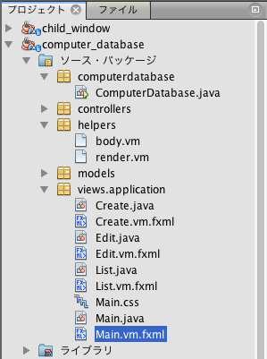

=============================================
レイアウトテンプレート
=============================================
ヘッダやフッターなどをアプリケーションの共通部分としてすべての画面に配置したい場合があります。

Creamyでは、このような共通部分を持った画面を作成するために、レイアウトテンプレートの仕組みがあります。

提供する機能
=============================================
Creamyの画面は、ActivityクラスとFXMLファイルのペアで構成されます。レイアウトテンプレートも、ActivityクラスとFXMLファイルのペアで構成されます。

レイアウトテンプレートを使うことで、アプリケーションとしての画面の統一性を保つことができます。

**実行例 - ComputerDatabase**

上の実行例では、赤い枠内をレイアウトテンプレートを使って作成しています。水色の枠内は、画面遷移によって表示が切り替わる領域です。

枠外のアドレスバーやタブ、メニューバーは、この画面（Browserクラス）の標準の構成要素です。

記述方法
=============================================
この例では、レイアウトテンプレートとしてMain.javaとMain.vm.fxmlを実装しています。

**パッケージ構成例**

**記述例 - Main.vm.fxml**

.. code-block:: html
  :linenos:

  <AnchorPane prefHeight="704.0" prefWidth="1024.0" xmlns:fx="http://javafx.com/fxml" 
          fx:controller="views.application.Main">
    <children>
      <BorderPane>
        <top>
          <AnchorPane>
            <children>
              <CFHyperlink id="home" layoutX="15.0" layoutY="15.0" 
                  text="Creamy Framework sample application - Computer database" 
                  path="/Application/list/0/name/asc/" />
            </children>
          </AnchorPane>
        </top>
        

          <StackPane>
            <children>
              <!--% #body -->
            </children>
          </StackPane>
        

      </BorderPane>
    </children>
  </AnchorPane>

4〜21行目の<BorderPane>が、実行例の赤枠にあたります。

5〜13行目の<top>は<BorderPane>の上部に配置される要素で、実行例の黒い帯のリンクバーにあたります。

14〜20行目の
は<BorderPane>の中心に配置される要素で、実行例の水色枠にあたります。Computer nameのリンクをクリックしたり、Add a new computerボタンをクリックすると次の画面に遷移しますが、黒い帯のリンクバーは表示されたままです。

17行目にVelocity構文で **#bodyマクロ** を記述しています。この部分が画面遷移によって書き替わります。
Velocity構文のマクロに関しては、`Creamy独自の記述方法の説明 <views.html#creamy>`_  を参照して下さい。

#bodyマクロ
*******************

上記の 実行例 - ComputerDatabase は初期画面で、水色枠にはコンピュータ一覧が表示されています。ここを描画しているのが、パッケージ構成例にある、List.javaとList.vm.fxmlファイルです。これらが、初期画面の #bodyマクロ 部分に展開されています。

@Templateアノテーション
*******************************

レイアウトテンプレートを使うためには、Activityクラスに@Templateアノテーションを記述します。次の記述例では、ListクラスにレイアウトテンプレートであるMain.classを指定しています。

**記述例 - List.java**

.. code-block:: java

 @Template(Main.class)
 public class List extends AvailableActivity {
     :

上記実行例で Add a new computer ボタンをクリックすると、次の画面に遷移します。Create.javaとCreate.vm.fxmlファイルが #bodyマクロ 部分に展開されています。

**実行例**

.. image:: views.AddComputer.png
    :width: 500px

**記述例 - Create.java**

.. code-block:: java

 @Template(Main.class)
 public class Create extends AvailableActivity {
     :

更に、コンピュータ一覧のコンピュータ名のリンクをクリックすると、次の画面に遷移します。Edit.javaとEdit.vm.fxmlファイルが #bodyマクロ 部分に展開されています。

**実行例**

これも他のActivityクラスと同様に、@Templateアノテーションを記述しています。

**記述例 - Edit.java**

.. code-block:: java

 @Template(Main.class)
 public class Edit extends AvailableActivity {
     :

