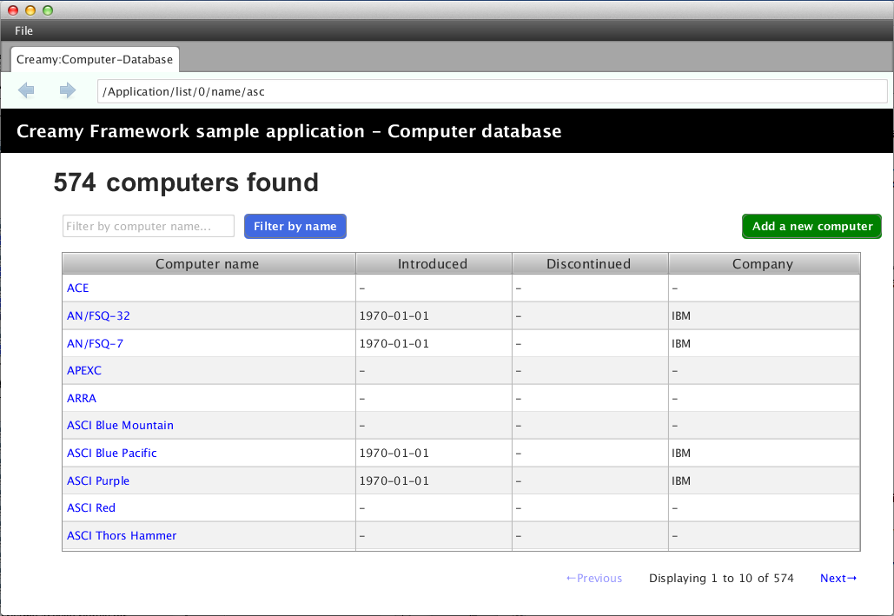
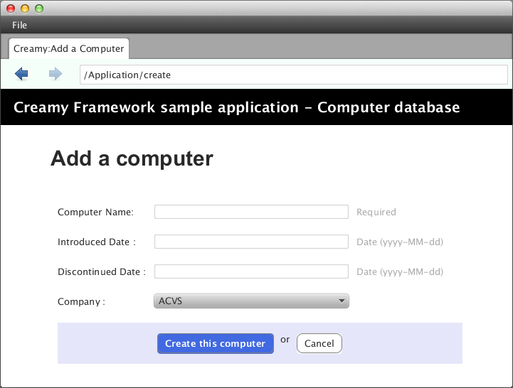

=============================================
Views
=============================================

viewsパッケージに置くべきファイル
=============================================
viewsパッケージは、MVCアーキテクチャのViewにあたるもので、画面表示に関わる次のファイルを配置します。

* javaファイル
* fxmlファイル
* cssファイル
* イメージファイル

これらのファイルは、viewsパッケージ配下に、Creamyコントローラクラス名をすべて小文字に変換した名前でパッケージを作成し、さらにその配下に配置します。

次の例は、新しいコンピュータデータを登録するCreamyアプリケーションのパッケージ構成です。

**パッケージ構成例**

.. image:: views.application.png

**画面例**

継承すべきクラス
=============================================
Activityクラスは、AvailableActivityクラスを継承して作成します。

**AvailableActivityクラス**

.. code-block:: java
   :linenos:
 
   public class AvailableActivity extends Activity implements Available {
     @Override
     public void initialize() {}
 
   }

initializeメソッドに画面の描画コードを記述します。

.. code-block:: java
   :linenos:

   public class List extends AvailableActivity {
 
   } 
 
継承すべきクラスが提供する機能
=============================================
Activityクラスは、画面表示に必要なFormコントロールの描画メソッドを提供します。

各Formコントロールについては、`Formコントロール <form_control.html>`_ を参照して下さい。

描画メソッドについては、`Activityクラスが提供するメソッド <form_control.html#activity>`_ を参照して下さい。

Activity記述例
*********************
次の例は、コンピュータデータ登録画面をAvailableActivityが提供するメソッドを使って作成しています。
画面描画内容は、Activityクラスのinitialize()メソッドで実装します。

**記述例 - Create.java**

.. code-block:: java
 :linenos:

 @Override
 public void initialize() {
  createForm.getChildren().add(
    gridForm("/Application/save").method(Request.POST).styleClass("grid-form")
      .row(label("Computer Name:"),
           text("name"),
           label("Required").styleClass(this.validationResult.hasError() ? "err-text" : "guide-text"))
      .row(label("Introduced Date :"),
           text("introduced").format(format),
           label("Date (" + DATE_FORMAT + ")").styleClass("guide-text"))
      .row(label("Discontinued Date :"),
           text("discontinued").format(format),
           label("Date (" + DATE_FORMAT + ")").styleClass("guide-text")    )
      .row(label("Company :"),
           choice("company.id").items(Company.options()).prefWidth(275))
      .row(hbox(submit("Create this computer").styleClass("btn-primary"),
                label(" or "),
                linkbutton("/Application/index").text("Cancel").styleClass("btn"))
          .padding(new Insets(15,0,15,140)).spacing(5)
          .styleClass("actions")
          ,3)
  );
 }

4行目でCFGridFormを生成しています。Applicationコントローラクラスのsaveメソッドを実行するパスを指定し、データ送信メソッドはPOSTを指定しています。

16行目でCFSubmitButtonを生成しています。

これは、HTMLのform要素にsubmitボタンを配置したイメージに相当します。

FXMLの書き方
=============================================
上記のCreate.javaに実装した内容を表示するには、Create.vm.fxmlファイルが必要です。

FXMLのより詳細な記述方法は、`こちら <http://docs.oracle.com/javafx/2/api/javafx/fxml/doc-files/introduction_to_fxml.html#overview>`_ を参照してください。

<AnchorPane>要素のfx:controller属性にコントローラクラス名を指定して、FXMLファイルとクラスファイルを関連づけます。

**記述例 - Create.vm.fxml**

.. code-block:: html
 :linenos:

 <AnchorPane id="AnchorPane" maxHeight="-Infinity" maxWidth="-Infinity" 
    minHeight="-Infinity" minWidth="-Infinity" 
    prefHeight="600.0" prefWidth="1000.0" 
    xmlns:fx="http://javafx.com/fxml" 
    fx:controller="views.application.Create">

views.application.Createクラスのinitialize()メソッドで実装した内容は、次の<StackPane>の<children>要素として指定しています。

**記述例 - Create.vm.fxml**

.. code-block:: xml
 :linenos:

 <StackPane id="stackPane1" fx:id="createForm" alignment="TOP_LEFT" 
          prefHeight="484.0" prefWidth="760.0" 
          AnchorPane.bottomAnchor="0.0" AnchorPane.leftAnchor="0.0" 
          AnchorPane.rightAnchor="0.0" AnchorPane.topAnchor="0.0">
    <children>
        :
    </children>
 </StackPane>

views.application.Createクラスでは、@FXMLアノテーションを付けおくことで<StackPane>と関連づけられます。

**記述例 - Create.java**

.. code-block:: java
 :linenos:

 public class Create extends AvailableActivity {
    @FXML private StackPane createForm;
        
 }

以下は、コンピュータデータ登録画面の実行例です。

**実行例**

Creamy独自の記述方法
=============================================
Creamyで使用するFXMLファイルには、Velocity構文を記述することが出来ます。FXMLファイルの拡張子が .vm.fxml となっているのは、Velocityのテンプレートとしての役割も持たせているためです。

次は、Velocity構文の **#renderマクロ** を使った例です。
**#renderマクロ** は、画面描画を部分的に置き換えるときに使います。

**記述例 - CommonPart.vm.fxml**

.. code-block:: html
 :linenos:

 <ChildPane fx:id="inputArea" prefHeight="196.0" prefWidth="463.0">
   <children>
     <!--% #render("NewComputer") -->
   </children>
 </ChildPane>

1行目の<ChildPane>要素はCreamy独自のもので、この部分がActivityに置き換わります。

3行目にVelocity構文を記述しています。**' <!--% '** と **' --> '** で囲むことで、FXMLとしてはコメントとして認識されます。**#renderマクロ** は１つの引数を取り、Activityクラス名を指定します。この例では "NewComputer" を指定していますので、NewComputer.java、NewComputer.vm.fxml の実装が必要です。

**#renderマクロ** は、次のように定義しています。

**記述例 - render.vm**

.. code-block:: text
 :linenos:

 #macro(render $child)
    <ChildPane child="$child" />
 #end

上の例の render.vm ファイルは、helpersパッケージに配置します。

