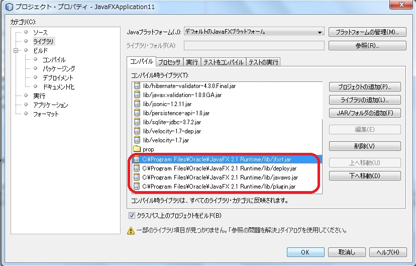

=============================================
Creamyプロジェクトの作成
=============================================

creamyのプロジェクトの作成手順を記述します。

以下のステップで作成します。

#. Creamyのインストール
#. 環境変数(PATH)への追加
#. NetBeansプロジェクトの新規作成
#. コマンド操作(shell, bat)によるCreamyプロジェクトに必要なファイルの生成

Creamyのインストール
=============================================

Creamyは、NetBeans上に作成したプロジェクトに対して、Creamyツール（creamy_tools）を実行することによってインストールします。
Creamyツールは、:download:`こちら <../_downloads/creamy_tools.zip>` からダウンロードしてください。
ダウンロードした圧縮ファイルを、任意のディレクトリに解凍して配置します。

（例）C:￥creamy、/home/user/creamy

環境変数(Path)への追加
=============================================

Creamyツールのインストールの後は、インストールディレクトリに環境変数のPathを通します。

・Windowsの場合（Windows7）

マイコンピュータのプロパティ-> システムの詳細設定-> 環境変数-> ユーザー環境変数からPathを選択して編集

すでに登録してある値の最後に、;（セミコロン）を追加した後に今回設定するパスを追加してください。

.. image:: path.PNG

NetBeansプロジェクトの新規作成
=============================================

NetBeansを起動し、ファイルメニューから新規プロジェクトを選択します。

新規プロジェクトダイアログにて、カテゴリにJavaFX、プロジェクトにJavaFXアプリケーションを選択します。

.. image:: NewProj.png

適切なプロジェクト名（例えば、NewProjeSample等）を付けて、Javaプラットフォームに「デフォルトの JavaFX プラットフォーム」を選択し、完了を押します。

.. image:: NamePlace.png

コマンドライン操作(bat、shell)によるCreamyプロジェクトに必要なファイルの生成
==============================================================================================

Creamyツールは、コンソール（Windowsの場合はコマンドプロンプト、Macの場合はターミナル）にて実行します。
コンソールを起動したら、NetBeansにて作成した新規プロジェクトのディレクトリまで移動します。

creamyのプロジェクトを新規作成するには、newコマンドを使用します。

（例）

.. code-block:: c
	:linenos:

	creamy_tools new

.. image:: new.PNG

"new comand done!" とメッセージが表示されたら成功です。

コマンド操作後のディレクトリツリーの作成結果
===============================================================

newコマンドを実行した後は、以下のようなディレクトリツリーの構成になります。

.. code-block:: java
	:linenos:

	プロジェクトフォルダ
	　│  ・・・
	　├─build
	　│  　  ・・・
	　├─dist
	　│  　  ・・・
	　├─lib
	　│      creamy.jar
	　│      ebean-2.7.3.jar
	　│      hibernate-validator-4.3.0.Final.jar
	　│      javax.validation-1.0.0.GA.jar
	　│      jsonic-1.2.11.jar
	　│      persistence-api-1.0.jar
	　│      sqlite-jdbc-3.7.2.jar
	　│      velocity-1.7-dep.jar
	　│      velocity-1.7.jar
	　├─nbproject
	　│  　  project.properties　・・・・・クラスパスの記述が追加される。
	　│  　  ・・・
	　├─prop
	　│      creamy.properties
	　│      ebean.properties
	　│      velocity.properties
	　└─src
	 　   ├─controllers
	  　  ├─helpers
	   　 │      render.vm
	   　 ├─models
	   　 ├─newprojsample
	    　│      NewProjSample.java　・・・エントリーポイントのjavaファイルはCreamy用に書き換えられる。
	  　  └─views

jarファイルの追加
=============================================

newコマンドの実行の後、libファイルが作成され、以下のように必要なライブラリのjarファイルが配置されます。

.. image:: lib.png

NetBeans7.2以降の場合の注意点
=============================================
NetBeans7.2以前の環境では、javaのランタイムが暗黙的に関連づけられていましたが、7.2以降ではプロジェクトプロパティのダイアログにて明示的に設定がされるようになりました。しかし、newコマンド実行の結果、この設定がクリアされてしまうため、下記の画面例に従って、４つのランタイムjarファイルを設定します。

ebean.propertiesの設定の注意点
=============================================

Creamyのプロジェクトは、デフォルトでSQLite3を使用してデータをストアします。そのため、O/Rマッパとして使用する Ebeanの設定ファイル（ebean.properties）は、以下のように設定されています。

.. code-block:: c
	:linenos:

	#SQLite
	datasource.default.username=
	datasource.default.password=
	datasource.default.databaseUrl=jdbc:sqlite:computer_database.sqlite3
	datasource.default.databaseDriver=org.sqlite.JDBC
	datasource.default.heartbeatsql=select 1
	datasource.default.isolationlevel=read_uncommitted

