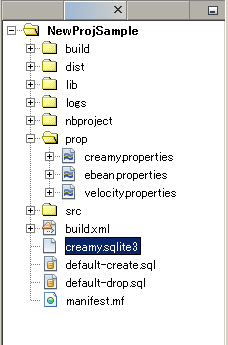

=============================================
scaffoldによるアプリケーション作成
=============================================

scaffoldコマンドの実行
=============================================
scaffoldコマンドを実行することにより、フレームワークに必要なMVCの各要素を生成します。

対象のプロジェクトのフォルダに移動し、テーブル名やそのカラム名、属性名を指定しながらscaffoldコマンドを実行します。コマンドの文法は以下の通りです。

scaffold [テーブル名] カラム名１:属性名 カラム名２:属性名　・・・

テーブル名およびカラム名には、任意の文字列を指定できます。先頭は英字しか指定できません。

属性名には、String、Short、Long、Integer、Double、Float、Char、Dateのいずれかしか指定できません。

（例）

.. code-block:: c
	:linenos:

	creamy_tools scaffold Company name:String num_branch:Integer

.. image:: scaffold.PNG

"scaffold command done!"のメッセージ表示がされたら成功です。

初期起動画面パスの記述
=============================================
main関数の記述されているエントリーポイントクラスのstartメソッドが、以下のように書き換えられています。
ただ、TabBrowerのコンストラクタに指定するパスは空文字で生成されるので以下の例に従って記述します。
XXXXXXXの部分は、controllerパッケージ配下に生成されたクラス名を参照して指定します（指定したテーブル名になります）。

.. code-block:: Java
	:linenos:

	public void start(Stage primaryStage) {
	    TabBrowser browser = new TabBrowser("/XXXXXXXController/list");		// このパス指定の記述を加える
	    browser.setMenuBar(new DefaultBrowserMenuBar());
	    browser.setHeader(new DefaultHeader());
	    primaryStage.setScene(browser);
	    primaryStage.show();
	}

完成イメージ
=============================================
scaffold実行後のsrcフォルダ配下は以下のようになります。

.. code-block:: c
	:linenos:

	プロジェクトフォルダ
		　│  ・・・
		　└─src
		    ├─controllers
		    │      CompanyController.java　・・・"Company"の部分は指定したテーブル名になる。
		    │      
		    ├─helpers
		    │      render.vm
		    │      
		    ├─models
		    │      Company.java　・・・"Company"の部分は指定したテーブル名になる。
		    │      
		    ├─newprojsample　・・・NetBeans上作成されたパッケージ名（プロジェクト名と同じ）になる。
		    │      NewProjSample.java　・・・エントリーポイントクラス。初期起動画面パスの記述の修正が必要。
		    │      
		    └─views
		        └─companycontroller　・・・"company"の部分は指定したテーブル名になる。
		                Edit.java
		                Edit.vm.fxml
		                Form.java
		                Form.vm.fxml
		                List.java
		                List.vm.fxml
		                Make.java
		                Make.vm.fxml
		                Show.java
		                Show.vm.fxml

アプリケーションの実行
=============================================
※ TBD

・SQLite3のDBファイル

newコマンド実行後、プロジェクトのフォルダ直下に、creamy.sqlite3というDBファイルが生成されます。

